# Entity Relationship Diagram

> **Required deliverable.** README: *"design the database to store the given information in the
> dataset and to support the below given user stories. **ER diagram should be provided.**"*
>
> Source dataset: `hdb-carpark-information-20220824010400.csv` — 2,181 records, 12 columns,
> `car_park_no` unique, no nulls.

---

## How to read this

A ten-table diagram is not meant to be absorbed in one go. Reviewers typically spend under a minute
on one, doing three things: find the table everything points at, follow the arrows outward in
groups, then spot-check a few columns to see whether the data was thought about.

So the model is presented in **three focused views first**, each answering one question, with the
complete diagram at the end for reference. Every image is **SVG** - click it and zoom as far as you
like without blurring.

| View | Answers |
|---|---|
| [1. The carpark and its lookups](#1-the-carpark-and-its-lookups) | How is the source data normalised, and where do the three user-story filters live? |
| [2. Users and favourites](#2-users-and-favourites) | Who owns a favourite, and how is that enforced? |
| [3. Ingestion audit](#3-ingestion-audit) | What happened during last night's run, and how would I recover it? |
| [4. Everything](#4-the-complete-model) | The full picture, for reference |

---

## 1. The carpark and its lookups

**The centre of the model.** `CARPARK` is the aggregate root; the four lookup tables exist because
those columns repeat thousands of times in a flat CSV.

[](diagrams/01-core.svg)

Three columns are worth looking at closely:

- **`gantry_height_m` is nullable, and `has_height_restriction` sits beside it.** That pair is user
  story 3. `NULL` means *no gantry exists*, which is what the source's `0.00` actually encodes -
  see [section 3](#3-gantry_height--the-critical-transformation).
- **`free_parking_type_id` is a foreign key, not a boolean.** Free parking is a *schedule*; the
  source has no `YES` value at all.
- **`latitude` / `longitude` are derived** from the SVY21 columns at ingestion, because no map SDK
  can plot SVY21.

---

## 2. Users and favourites

[](diagrams/02-users.svg)

Two things this view is meant to show:

- **`USER_FAVOURITE` has a composite primary key** `(user_id, carpark_id)`. A duplicate favourite is
  impossible even by direct SQL, which is what makes the idempotent `PUT` a guarantee rather than a
  convention.
- **`REFRESH_TOKEN.replaced_by_id` points at its successor**, forming a rotation chain. That chain is
  what makes reuse detection possible: a single-use token presented twice means a copy exists, so
  every token in the chain is revoked.

`app_user.id` is reachable only from the JWT `sub` claim. No endpoint accepts a user identifier.

---

## 3. Ingestion audit

[](diagrams/03-ingestion.svg)

This is the half of the schema that exists purely so a failure at 03:00 is diagnosable:

- **`CARPARK_STAGING`** absorbs the whole file in batches, so only the final swap needs to be atomic.
  Truncated at the start and end of every run; never a source of truth.
- **`JOB_RUN.lease_expires_at`** is heartbeated. An expired lease on a `Running` row means the
  process died, and the next startup reclaims it automatically.
- **`JOB_RUN_ERROR`** carries the line number, the field and the raw text, so a source file can be
  corrected without reading a log.
- **`records_unchanged`** is the scaling property: on a real delta most rows match their hash and
  are never written.

---

## 4. The complete model

[](diagrams/00-full.svg)

The Mermaid source below is the record of truth - it renders inline on GitHub, diffs like code, and
the images above are generated from it, so the two cannot drift apart.

```mermaid
erDiagram
    CAR_PARK_TYPE            ||--o{ CARPARK : classifies
    PARKING_SYSTEM_TYPE      ||--o{ CARPARK : "billed via"
    SHORT_TERM_PARKING_TYPE  ||--o{ CARPARK : "short-term policy"
    FREE_PARKING_TYPE        ||--o{ CARPARK : "free-parking policy"
    CARPARK                  ||--o{ USER_FAVOURITE : "is favourited in"
    APP_USER                 ||--o{ USER_FAVOURITE : favourites
    APP_USER                 ||--o{ REFRESH_TOKEN : holds
    JOB_RUN                  ||--o{ JOB_RUN_ERROR : records
    JOB_RUN                  ||--o{ CARPARK : "last written by"
    JOB_RUN                  ||--o{ CARPARK_STAGING : loads

    CAR_PARK_TYPE {
        int      id PK
        string   code UK "SURFACE, MULTI_STOREY, BASEMENT, COVERED, SURFACE_MULTI_STOREY, MECHANISED, MECHANISED_AND_SURFACE"
        string   name     "source text, verbatim"
        bool     is_active
    }

    PARKING_SYSTEM_TYPE {
        int      id PK
        string   code UK  "ELECTRONIC, COUPON"
        string   name      "source text, verbatim"
    }

    SHORT_TERM_PARKING_TYPE {
        int      id PK
        string   code UK      "WHOLE_DAY, T0700_2230, T0700_1900, NONE"
        string   description  "source text, verbatim"
        time     start_time   "NULL when WHOLE_DAY or NONE"
        time     end_time     "NULL when WHOLE_DAY or NONE"
        bool     is_whole_day
        bool     is_available "FALSE only for NONE"
    }

    FREE_PARKING_TYPE {
        int      id PK
        string   code UK      "NONE, SUN_PH_0700_2230, SUN_PH_1300_2230"
        string   description  "source text, verbatim"
        time     start_time
        time     end_time
        bool     applies_sun_and_ph
        bool     is_offered   "FALSE only for NONE -- drives the free-parking filter"
    }

    CARPARK {
        int      id PK                      "surrogate; SQLite rowid alias"
        string   car_park_no UK             "natural business key; the public API identifier"
        string   address                    "free text; contains commas in source"
        decimal  svy21_x                    "source x_coord, metres"
        decimal  svy21_y                    "source y_coord, metres"
        double   latitude                   "derived WGS84"
        double   longitude                  "derived WGS84"
        int      car_park_type_id FK
        int      parking_system_type_id FK
        int      short_term_parking_type_id FK
        int      free_parking_type_id FK
        bool     has_night_parking
        int      deck_count
        decimal  gantry_height_m            "NULL = unrestricted -- see note 3"
        bool     has_height_restriction     "FALSE for source 0.00 and 9.99"
        decimal  gantry_height_raw          "source verbatim, retained for audit"
        bool     has_basement
        string   source_row_hash            "SHA-256; skips no-op updates"
        bool     is_active                  "soft delete"
        datetime first_seen_at
        datetime last_seen_at
        datetime last_modified_at
        int      last_job_run_id FK         "lineage"
    }

    APP_USER {
        int      id PK
        string   email UK
        string   password_hash              "PBKDF2-HMAC-SHA256, 210k iters, per-user salt"
        string   display_name
        string   role                       "User | Admin"
        bool     is_locked_out
        int      failed_login_count
        datetime lockout_ends_at
        datetime created_at
    }

    USER_FAVOURITE {
        int      user_id PK,FK
        int      carpark_id PK,FK
        datetime created_at
    }

    REFRESH_TOKEN {
        int      id PK
        int      user_id FK
        string   token_hash UK              "SHA-256; the raw token is never stored"
        datetime expires_at
        datetime revoked_at
        int      replaced_by_id FK          "rotation chain -- enables reuse detection"
        string   created_by_ip
    }

    JOB_RUN {
        int      id PK
        string   job_name
        string   file_name
        string   file_hash                  "SHA-256 of file bytes -- idempotency key"
        string   status                     "Pending|Running|Succeeded|Failed|RolledBack|Skipped"
        string   file_mode                  "Delta | Snapshot"
        datetime started_at
        datetime completed_at
        datetime lease_expires_at           "crash detection"
        string   host_name
        int      records_read
        int      records_inserted
        int      records_updated
        int      records_unchanged
        int      records_deactivated
        int      records_rejected
        int      attempt_number
        string   error_summary
    }

    JOB_RUN_ERROR {
        int      id PK
        int      job_run_id FK
        int      line_number                "exact line in the source file"
        string   car_park_no
        string   field_name
        string   error_code
        string   severity                   "Error | Warning"
        string   message
        string   raw_line                   "the offending line, verbatim"
    }

    CARPARK_STAGING {
        int      id PK
        int      job_run_id FK
        string   car_park_no
        string   all_source_columns         "mirrors CARPARK's source columns, pre-merge"
        string   source_row_hash
        int      line_number
    }
```

<details>
<summary><b>Mermaid source</b></summary>



</details>

---

## Design notes

### 1. Normalisation — 3NF

The source CSV is flat and fully denormalised. Four low-cardinality repeated text columns are
extracted into lookup tables:

| Source column | Distinct values | Most-repeated value | Occurrences |
|---|---:|---|---:|
| `car_park_type` | 7 | `SURFACE CAR PARK` | 1,087 |
| `type_of_parking_system` | 2 | `ELECTRONIC PARKING` | 1,998 |
| `short_term_parking` | 4 | `WHOLE DAY` | 1,758 |
| `free_parking` | 3 | `SUN & PH FR 7AM-10.30PM` | **1,594** |

Storing `"SUN & PH FR 7AM-10.30PM"` 1,594 times is a transitive dependency on a non-key attribute:
`car_park_no → free_parking_policy → policy text`. Extracting it removes the update, insert and
delete anomalies, and shrinks the filter columns from 24-byte strings to 4-byte integer FKs — which
is what makes the composite covering index small enough to stay resident.

### 2. Where normalisation deliberately stops

`address` is **not** decomposed into block / street / postal code. The source formats are irregular
(`BLK 135-138,141,142 & 145 TECK WHYE LANE/AVE`), the feed contains no postal code, and the only
access pattern is substring search. Any parser would be lossy and permanently wrong on some subset.
Over-normalisation that destroys source fidelity is a defect, not a virtue.

`gantry_height_m` stays a measure on `carpark` rather than becoming a lookup — 34 distinct values,
genuinely continuous, and it is the range predicate in the hottest query in the system.

### 3. `gantry_height` — the critical transformation

`gantry_height = 0.00` occurs on **477 rows, and every one is a `SURFACE CAR PARK`** (477/477).
`9.99` occurs on 67 rows, also all surface. Neither is a measurement: `0.00` means *no gantry
exists*; `9.99` is the source system's *unlimited* sentinel.

Both are normalised at ingestion to `gantry_height_m = NULL` with
`has_height_restriction = false`, and the raw value is retained in `gantry_height_raw`.

The user story *"carpark that can meet my vehicle height requirement"* therefore becomes:

```sql
WHERE has_height_restriction = 0 OR gantry_height_m >= :vehicleHeight
```

For a 2.0 m vehicle this returns **2,056** carparks. The naive `gantry_height >= 2.0` returns
**1,579** — silently hiding 477 open-air carparks, 23% of the dataset.

### 4. `free_parking` is a schedule, not a boolean

The source has **no `YES` value**. The three values are `NO`, `SUN & PH FR 7AM-10.30PM`, and
`SUN & PH FR 1PM-10.30PM`. The user story *"carpark that offer free parking"* maps to
`free_parking_type.is_offered = 1` (1,605 carparks), not to a boolean column that does not exist.
Start and end times are stored so a future *"free parking right now"* story needs no schema change.

### 5. Relationship cardinalities

| Relationship | Cardinality | Reason |
|---|---|---|
| lookup → `CARPARK` | 1 : 0..N | A carpark has exactly one of each classification; a newly auto-registered type legitimately has zero carparks until the next feed |
| `APP_USER` ↔ `CARPARK` | M : N via `USER_FAVOURITE` | The junction's composite PK `(user_id, carpark_id)` makes a duplicate favourite **structurally impossible** — the idempotent `PUT` is enforced by the schema, not just by code |
| `APP_USER` → `REFRESH_TOKEN` | 1 : 0..N | Multiple devices; `replaced_by_id` self-reference forms the rotation chain that makes reuse detection possible |
| `JOB_RUN` → `JOB_RUN_ERROR` | 1 : 0..N | One run yields the complete defect list — validation collects all errors rather than aborting on the first |
| `JOB_RUN` → `CARPARK` | 1 : 0..N | `last_job_run_id` gives every row full lineage: which file, which run, when |

### 6. Referential-integrity policy

```sql
user_favourite.user_id     REFERENCES app_user(id) ON DELETE CASCADE
user_favourite.carpark_id  REFERENCES carpark(id)  ON DELETE RESTRICT
carpark.*_type_id          REFERENCES <lookup>(id) ON DELETE RESTRICT
```

`ON DELETE RESTRICT` on `carpark` means a favourited carpark **cannot be hard-deleted** — which is
precisely why the ingestion job soft-deactivates (`is_active = 0`) instead. The schema enforces the
policy rather than trusting the batch job to honour it.

> **SQLite note:** foreign keys are **off by default** and must be enabled per connection with
> `PRAGMA foreign_keys = ON`. A schema full of `REFERENCES` clauses that enforce nothing is worse
> than having no constraints, because it produces false confidence. An integration test asserts the
> pragma is set.

### 7. Indexes

```sql
CREATE UNIQUE INDEX ux_carpark_car_park_no ON carpark (car_park_no);

-- Covering index for the three user-story filters.
-- Equality predicates first, the range predicate last, key last.
CREATE INDEX ix_carpark_search
    ON carpark (is_active, has_night_parking, free_parking_type_id,
                has_height_restriction, gantry_height_m, id);

CREATE INDEX ix_carpark_keyset ON carpark (is_active, car_park_no);
CREATE INDEX ix_carpark_geo    ON carpark (latitude, longitude);
CREATE INDEX ix_favourite_user ON user_favourite (user_id, created_at DESC);
CREATE INDEX ix_favourite_park ON user_favourite (carpark_id);
CREATE UNIQUE INDEX ux_job_run_file_hash ON job_run (file_hash) WHERE status = 'Succeeded';
CREATE INDEX ix_job_run_status ON job_run (status, lease_expires_at);
```

**Column order in `ix_carpark_search` is the design decision.** A B-tree index is usable for seeking
only up to and including the **first range predicate**. `gantry_height_m` is the only range
predicate, so it must come last among the filter columns — placing it earlier would make every
column after it unusable for seeking. `is_active` leads because a global query filter applies it to
every query, and the trailing `id` makes the index *covering* for the keyset projection.

Asserted by test, not assumed:

```csharp
plan.Should().Contain("USING COVERING INDEX ix_carpark_search");
plan.Should().NotContain("SCAN carpark");
```

---

> **Regenerating the images.** They are produced from the `.mmd` files in `docs/diagrams/`:
>
> ```bash
> npx -y @mermaid-js/mermaid-cli -i docs/diagrams/01-core.mmd >     -o docs/diagrams/01-core.svg -b white
> ```

*All counts measured directly from `hdb-carpark-information-20220824010400.csv`.
Diagram is Mermaid and renders natively on GitHub.*
